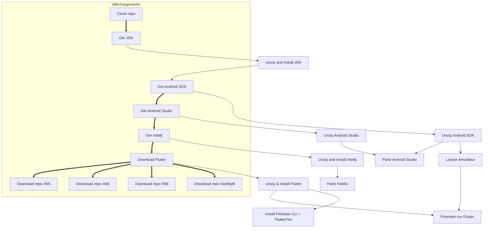

# Scripts d'installation des IDE pour le mobile

Les scripts suivants permettent d'installer:

- Android Studio et les différents plugins
- Le SDK d'Android et le mettre à jour
- Intellij Idea et les différents plugins
- Le SDK de Flutter

## Procédure

1. Télécharger le script suivant : [script PowerShell](https://raw.githubusercontent.com/departement-info-cem/scripts-mobile/main/installation-mobile.ps1 "download")
2. Si le fichier s'ouvre dans le navigateur, faire CTRL+S pour l'enregistrer, ou cliquer droit sur le lien et faire "Enregistrer sous"
3. Cliquer droit sur le fichier téléchargé
4. Choisir "Exécuter avec PowerShell"

## Diagramme

## Travailler sur le script

### Comment fonctionne le script ?

Pour installer les logiciels des cours de 3N5, 4N6 et 5N6, le script commence par télécharger des sous scripts qui se chargent d'effectuer les étapes décrites dans le diagramme ci-haut.

- Un *cache* des logiciels est conservé sur le disque réseau du département, soit dans `\\ed5depinfo\Logiciels\Android\scripts`. Le script se charge de copier les logiciels compressés sur le disque de local, et de les extraires aux bons endroits.
- Les sous-scripts démarrent un émulateur android
- Les sous-scripts installent les outils de ligne de commande comme FlutterFire et Firebase CLI
- Les sous-scripts démarrent un projet de base de Flutter pour que lorsque les étudiants vont se créer leur propre projet, plusieurs des fichiers nécessaires aient déjà été mis dans un cache géré par gradle.
- L'ordre d'exécution des scripts s'assure que les fichiers soient bien extraits avant de lancer les sous-scripts qui s'en servent.

### Pour les profs (et étudiants courageux), comment travailler en mode dev

1. Clonez le projet sur votre machine
2. Assurez vous de toujours avoir un backup `\\ed5depinfo\Logiciels\Android\scripts\cache` avant de commencer afin de pouvoir revenir en arriève rapidement si nécessaire
3. Ouvrir et modifier le fichier [https://github.com/departement-info-cem/scripts-mobile/blob/main/installation-mobile.ps1](https://github.com/departement-info-cem/scripts-mobile/blob/main/installation-mobile.ps1)
4. Assignez la valeur `$true` à la variable `$devMode`
   - Plutôt que de télécharger les sous-script dans un autre dossier sur votre machine, le script principal va se référer aux scripts qui ont été clonés. Vous pouvez donc les modifier directement.
   - Le répertoire du *cache* utilisé sera `\\ed5depinfo\Logiciels\Android\scripts\cacheDev` plutôt que `\\ed5depinfo\Logiciels\Android\scripts\cache`. Ainsi vous n'avez pas à avoir peur de briser ce qui se trouve dans `cacheDev`
5. Une fois que vous avez testé toutes les modifications au script et que vous êtes certains que tout fonctionne, vous pouvez remettre la variable `$devMode` à `$false` et effectuer une Pull Request pour faire approuver vos changements.

### Mise à jour des logiciels

1. Clonez le projet sur votre machine
2. Ouvrir et modifier [https://github.com/departement-info-cem/scripts-mobile/blob/main/sub-scripts/urls-et-versions.ps1](https://github.com/departement-info-cem/scripts-mobile/blob/main/sub-scripts/urls-et-versions.ps1)
3. Pour forcer le téléchargement des nouvelles versions, il faut vider le dossier (`\\ed5depinfo\Logiciels\Android\scripts\cacheDev`) contenant la cache de ZIP
4. Partir le script principal. Le script va détecter les éléments manquants et les télécharger.
5. Remplacez `cache` par `cacheDev`. Vous devriez tout de même effectuer une copie de sauvegarde de `cache`.

## Améliorations

Les améliorations et suggestions sont listés sous les [issues du projet](https://github.com/departement-info-cem/scripts-mobile/issues). Nous vous encourageons à soumettre un issue si vous remarquez un comportement non désiré en exécutant le script ou si vous avez une suggestion à nous faire.

## Crédits

Développé et maintenu avec ❤️ par [PierreOlivierBrillant](https://github.com/PierreOlivierBrillant) et [jorisdeguet](https://github.com/jorisdeguet)
