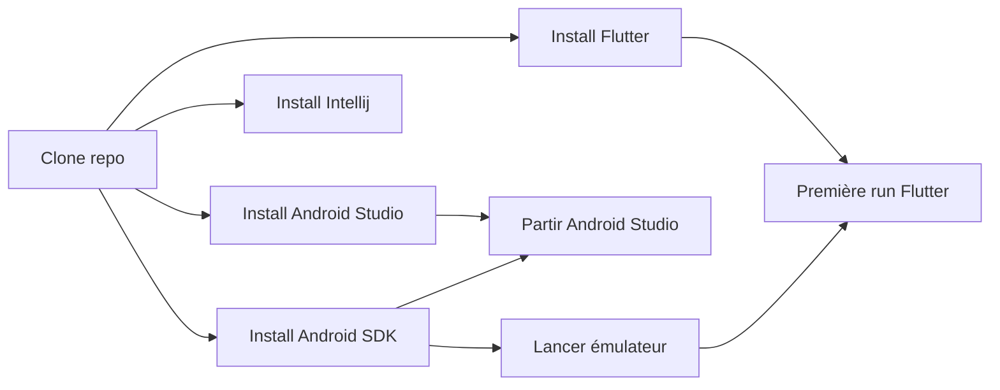

# Scripts d'installation des IDE pour le mobile

Les scripts suivants permettent d'installer:
- Android Studio et les différents plugins
- Le SDK d'Android et le mettre à jour
- Intellij Idea et les différents plugins
- Le SDK de Flutter

## Procédure

1. Télécharger le script suivant : [script PowerShell](https://raw.githubusercontent.com/departement-info-cem/scripts-mobile/main/installation-mobile.ps1 "download")
2. Si le fichier s'ouvre dans le navigateur, faire CTRL+S pour l'enregistrer, ou cliquer droit sur le lien et faire "Enregistrer sous"
3. Cliquer droit sur le fichier téléchargé
4. Choisir "Exécuter avec PowerShell"

## Diagramme

## Pour les profs pour changer les versions
1. Ouvrir et modifier https://github.com/departement-info-cem/scripts-mobile/blob/main/sub-scripts/urls-et-versions.ps1
2. Pour forcer le téléchargement des nouvelles versions, il faut vider le dossier contenant la cache de ZIP
3. Partir le script principal. Le script va détecter les éléments manquants et les télécharger.
